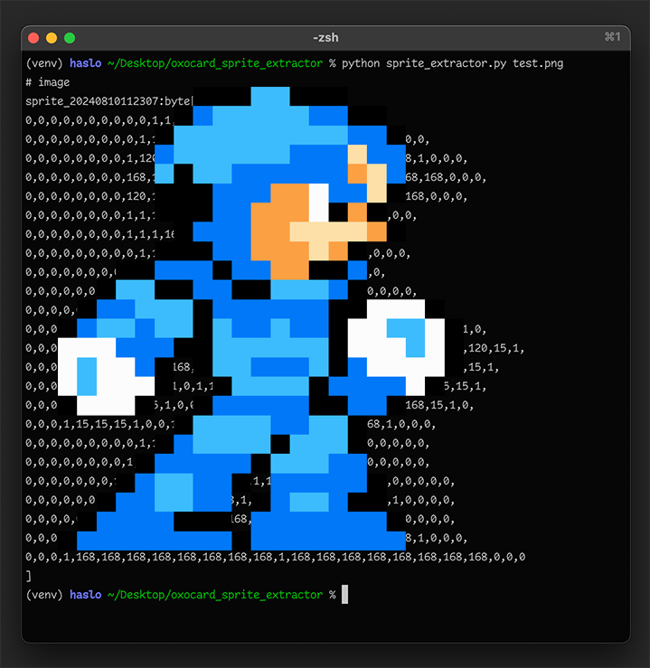

# Sprite Converter

This tool converts PNG images to NanoPy sprite data for game development.



Check out the [Oxocard repo](https://github.com/oxocard) for what this is for.

## Setup

This is assuming you have python running on your machine.

1. Create virtual environment:

```bash
python -m venv venv
```

2. Activate virtual environment:

Windows:
```cmd
venv\Scripts\activate
```

macOS/Linux:

```bash
source venv/bin/activate
```

3. Install requirements:

```bash
pip install -r requirements.txt
```

## Usage

Run the script with:

```bash
python process_sprite.py path/to/your/image.png
```

The output will be printed to the console, showing the sprite data with a unique timestamp identifier.

Remember to activate the virtual environment each time you use the script.

## Testing

There is one unit test.

```bash
python test_sprite_extractor.py
```

### Example Image

The example image included is reminescent of a famous video game character, but a new creation. It was created by [@Enderman55](https://www.github.com/Enderman55).
